# Application Services Assignment: Written Report

## Notes

Author: David Trickey, Principal Solutions Engineer (Cloudflare UK&I Public Sector) Domain: fde-demo.trickey.solutions Repositories:

- fde-demo-lab — Infrastructure as Code (OpenTofu), the /secure Worker, click-ops guide, and this report
- fde-demo-deck — the interactive presentation, itself a Cloudflare Worker, that live-tests and observes the environment
- fde-demo-origin — a dependency-free live-reload origin used behind the Tunnel

## The honest bit first

First: I used an enterprise account for this implementation rather than a free plan account which I am declaring upfront before the technical content. The reasons are practical. Sub-domain DNS delegation (fde-demo.trickey.solutions) is an Enterprise-tier feature. Activating R2 on a standard account requires adding a payment card. And I wanted to reuse an existing httpbin origin via a Snippet rather than provision a fresh one. None of this changes the core mechanics. Full Strict TLS, Cloudflare Tunnel, Zero Trust Access, Workers, and R2 bindings work identically on the free tier. The documented build in [PREREQUISITES.md](PREREQUISITES.md) runs clean on a free plan apex zone, and the free tier is where any customer would start.

Second: I used AI tooling to write the Terraform configuration and presentation deck boilerplate. I provided the insights, the architecture decisions, the design rationale, and the direction. The AI did the typing. 

## What I built

To meet the requirements of the brief, I put the full Cloudflare application-services chain in front of an HTTP header-echo origin: authoritative DNS and proxy, end-to-end Post Quantum TLS in Full (Strict) mode validating the origin certificate, a Cloudflare Tunnel publishing a private origin with no public inbound, Zero Trust Access locking '/secure' to 'me' plus '@cloudflare.com', and a Worker that returns the authenticated identity and serves a country flag from a private R2 bucket.

Then I built something not in the brief: the presentation itself is a Cloudflare Worker. It live-tests the deployed environment from within the edge network, queries the Cloudflare API for observability data, and renders everything in a browser. The API token is stored as a Worker secret and never touches the client. If any check fails, the dashboard tells you exactly which requirement is broken and what the HTTP response was.

That second part is the part that makes the argument.

## Accessing the live environment

The following endpoints are live for the duration of the assessment: *note tunnel end points may be down outside of live demonstration windows*

| Endpoint | What it demonstrates |
| --- | --- |
| https://httpbin.fde-demo.trickey.solutions/headers | Public origin returning all HTTP headers, Cloudflare-injected headers visible in the response body |
| https://tunnel.fde-demo.trickey.solutions/ | A local origin reached via Cloudflare Tunnel, no public inbound port |
| https://tunnel.fde-demo.trickey.solutions/secure | Zero Trust-gated path. Enter a @cloudflare.com email address, receive a One-Time PIN, authenticate. The Worker returns the identity string and country flag link. |
| https://tunnel.fde-demo.trickey.solutions/secure/GB | Flag served from the private R2 bucket via Worker binding. Substitute any ISO country code. |
| https://deck.fde-demo.trickey.solutions | Interactive presentation Worker. Runs live checks, allows you to explore the architecture and displays observability data from the Cloudflare API. |
| https://deck.fde-demo.trickey.solutions/api/checks/run | JSON validation endpoint. Returns pass/fail for all eight requirements. |

To authenticate at /secure: when Cloudflare Access intercepts the request, select "One-Time PIN" as the login method and enter a valid @cloudflare.com email address. The PIN arrives by email and grants a session.

## 2a. Steps followed, with configuration and testing evidence

Screenshots of each configuration step and the working application are in the docs/img/ directory of fde-demo-lab. The requirement-by-requirement coverage matrix is in [REQUIREMENTS-COVERAGE.md](REQUIREMENTS-COVERAGE.md). What follows is the narrative of how the environment was built, with a focus on the decisions that are not obvious from the docs alone.

### Pre-requisites: zone on Cloudflare

fde-demo.trickey.solutions is active on Cloudflare with delegated nameservers. The IaC operates on an already-active zone. [PREREQUISITES.md](PREREQUISITES.md) covers the genuinely manual steps: the registrar nameserver change, R2 activation, and creating the Google OAuth credentials for the IdP.

Live check: dig NS fde-demo.trickey.solutions resolves to *.ns.cloudflare.com.

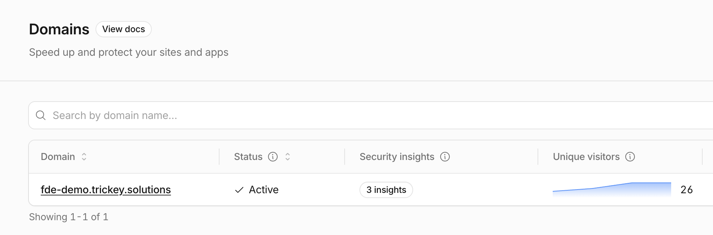

### Step 1: An origin that returns all request headers

I used httpbin's /headers endpoint, which echoes every inbound HTTP header in the response body. On the public origin, this runs on Azure App Service. Behind the Tunnel, it is fde-demo-origin, a dependency-free Node.js server with live-reload, so I can demonstrate the Tunnel reconnecting in real time during a presentation.

The detail worth pausing on: once Cloudflare is in front, the response includes Cf-Ray, Cf-Connecting-Ip, Cf-Ipcountry, and the full set of edge-injected headers. The origin sees a different request than the client sends. Understanding that gap is useful; it explains a lot of what comes later.

Live check: GET https://httpbin.fde-demo.trickey.solutions/headers returns 200 with Cloudflare headers visible in the body.

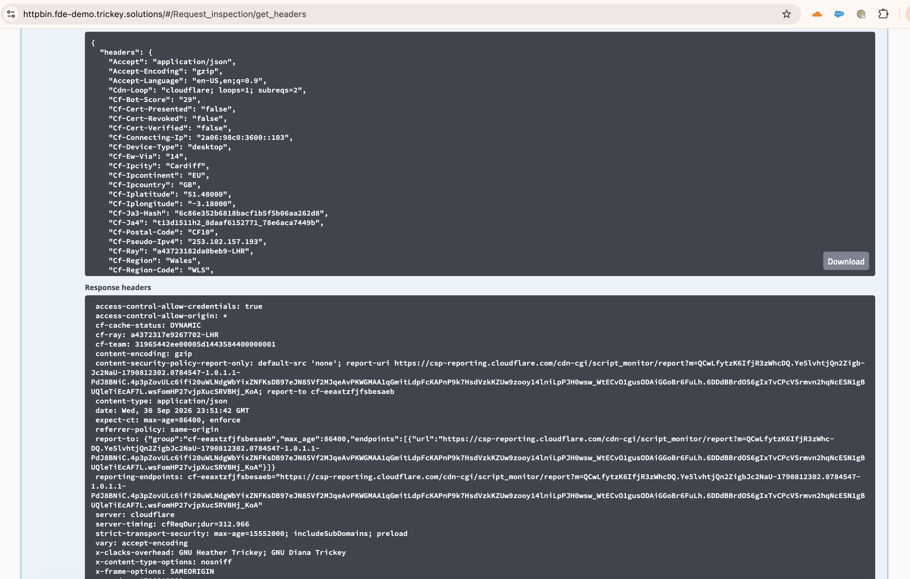

Reference: [Cloudflare HTTP headers](https://developers.cloudflare.com/fundamentals/reference/http-headers/)

### Step 2: Proxy through Cloudflare

Proxied (orange-cloud) DNS for httpbin.<zone> points to the Azure origin. Cloudflare terminates TLS at the edge, applies zone settings, and hides the origin IP.

IaC: [terraform/10-dns.tf](../terraform/10-dns.tf). Live check: the hostname resolves to Cloudflare anycast. A direct connection to the Azure IP hits a 403 from the IP allowlist we configure in Step 6.

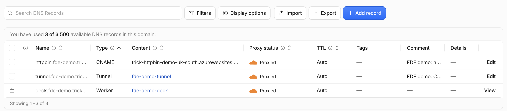

Reference: [DNS proxy status](https://developers.cloudflare.com/dns/proxy-status/)

### Step 3: Full (Strict) TLS with a non-Cloudflare certificate

Zone SSL mode is Full (Strict). That means Cloudflare validates the certificate at the origin, not just encrypts the connection. The common name must match the requested hostname, and the certificate must be signed by a publicly trusted CA.

The Azure App Service presents a managed certificate for the hostname. The important detail here is SNI behaviour: Full (Strict) validates against the *requested* hostname, not whichever certificate the origin has available. The default App Service certificate is for *.azurewebsites.net, which does not match httpbin.fde-demo.trickey.solutions. That drove the decision to configure a custom domain certificate on the App Service rather than using the default.

IaC: [terraform/00-zone.tf](../terraform/00-zone.tf) with ssl = "strict". Independent verification: Qualys SSL Labs returns an A+ rating. I do not mark my own homework.

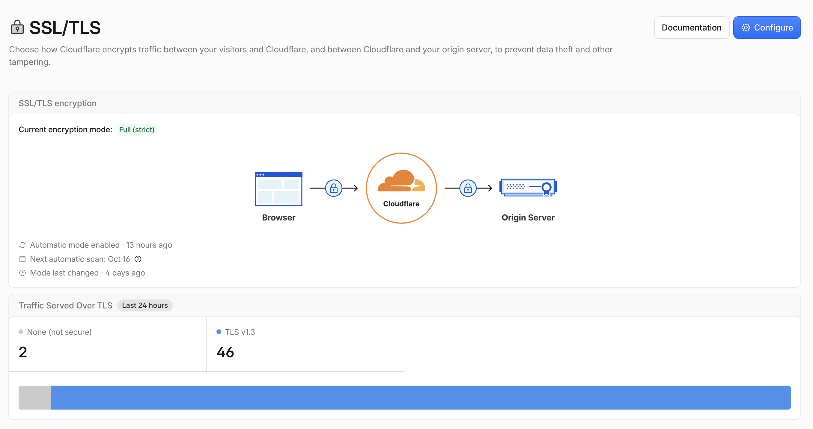

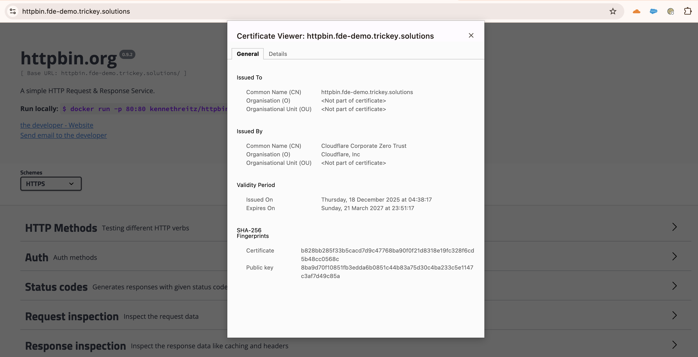

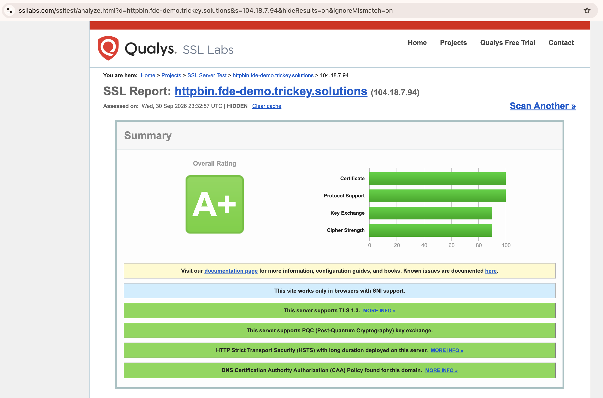

Reference: [Full (Strict) TLS mode](https://developers.cloudflare.com/ssl/origin-configuration/ssl-modes/full-strict/)

### Step 4: Cloudflare Tunnel on tunnel.<zone>

A remotely-managed Tunnel. cloudflared runs on the VM and dials outbound only, so the origin has no public inbound ports. Ingress routes tunnel.fde-demo.trickey.solutions to the local origin.

A clarification that is worth getting right: a Cloudflare Tunnel is already an encrypted and mutually authenticated outbound connection. It does not require a separately-trusted TLS certificate at the local origin. Full (Strict) is a separate requirement on the *public* origin, demonstrating something different. They are not the same thing.

IaC: [terraform/50-tunnel.tf](../terraform/50-tunnel.tf) with config_src = "cloudflare" (remotely-managed ingress, not a local YAML file). Live check: the Tunnel endpoint only responds when the connector is running. If the VM is off, the check fails red. That is honest.

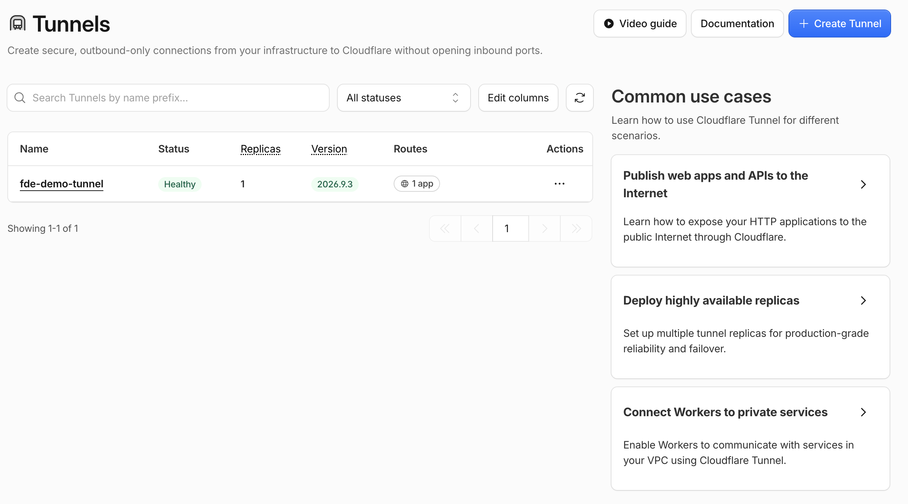

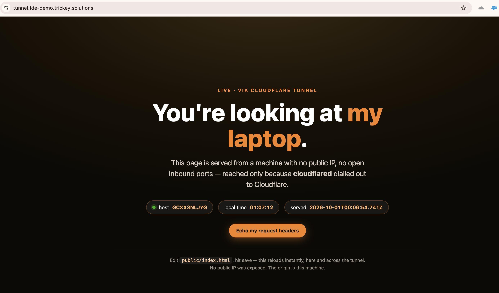

Reference: [Connect networks with Cloudflare Tunnel](https://developers.cloudflare.com/cloudflare-one/connections/connect-networks/)

### Step 5: SSO Identity Provider in Zero Trust

Google is the primary IdP. Cloudflare employees use Google Workspace, so @cloudflare.com users authenticate without needing a separate account. One-Time PIN is configured as a fallback for anyone reviewing the environment without a Google account.

IaC: [terraform/20-identity.tf](../terraform/20-identity.tf).

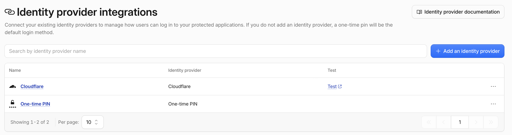

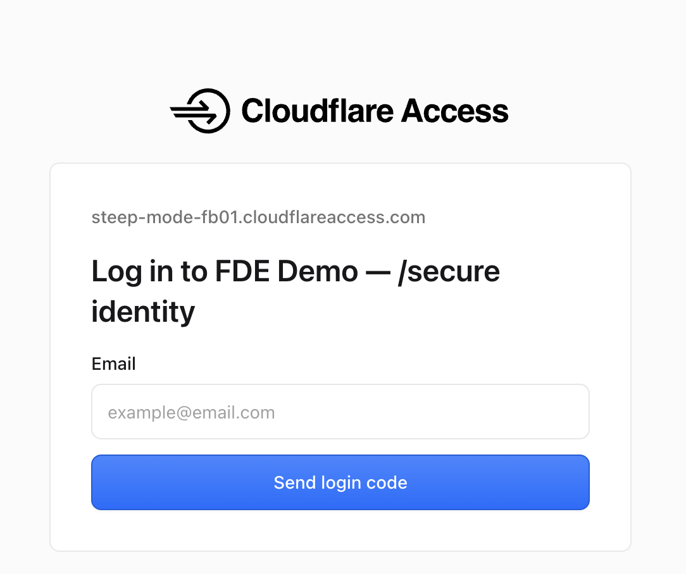

Reference: [Google IdP integration](https://developers.cloudflare.com/cloudflare-one/identity/idp-integration/google/)

### Step 6: Lock down /secure and prevent bypass

A Zero Trust Access Application on tunnel.<zone>/secure with an Allow policy covering: my email address, email_domain = cloudflare.com, and a live-editable attendee list maintained via [scripts/add-attendee.sh](../scripts/add-attendee.sh). Everyone else is denied.

Bypass is prevented in three layers:

1. The /secure origin is only reachable via the Tunnel. There is no public IP to target. 2. The Azure public origin is restricted to Cloudflare egress IP ranges at the firewall. 3. Authenticated Origin Pulls (mTLS) means the origin trusts only Cloudflare's certificate. Even if someone discovers the IP and spoofs the right source range, the mutual TLS handshake fails.

Live check: an unauthenticated GET to /secure returns a redirect to the Cloudflare Access login screen, not a 200.

IaC: [terraform/40-access-secure.tf](../terraform/40-access-secure.tf), [30-access-lists.tf](../terraform/30-access-lists.tf), [70-origin-security.tf](../terraform/70-origin-security.tf).

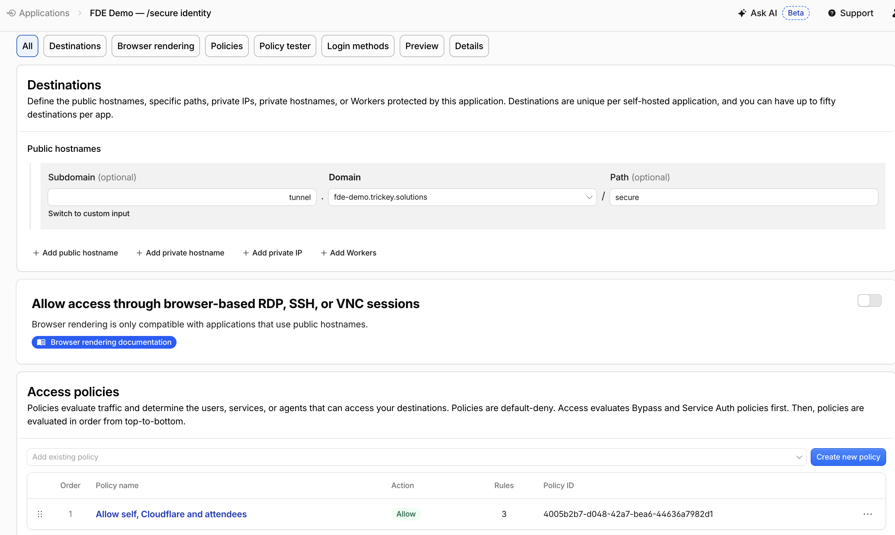

Reference: [Zero Trust Access policies](https://developers.cloudflare.com/cloudflare-one/policies/access/)

### Step 7: The Worker

Built with the Wrangler CLI, served on tunnel.<zone>/secure* via a Worker route.

/secure reads the Access-injected Cf-Access-Authenticated-User-Email header, timestamps the request, reads request.cf.country, and returns HTML:

```text
${EMAIL} authenticated at ${TIMESTAMP} from ${COUNTRY}
```

${COUNTRY} is an anchor tag linking to /secure/${COUNTRY}.

/secure/${COUNTRY} streams the matching flag SVG from the private R2 bucket fde-demo-flags with Content-Type: image/svg+xml.

The bucket is private. There is no public URL. The only path to a flag is through the Worker, which means only through Access. The signed JWT (CF-Access-Jwt-Assertion) is available for cryptographic verification of the identity claim if stricter validation is needed; for this deployment the header injection is sufficient.

IaC note: the Worker route is in [terraform/80-worker-route.tf](../terraform/80-worker-route.tf) as a commented alternative, but Wrangler owns the Worker deployment to avoid dual-writer drift between Terraform state and the Workers API. The rationale is explained in [IAC-VS-CLICKOPS.md](IAC-VS-CLICKOPS.md).

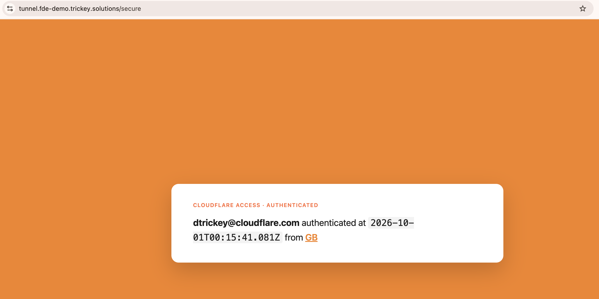

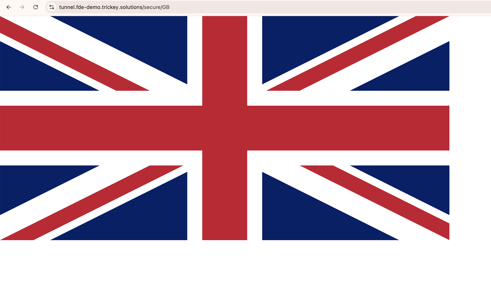

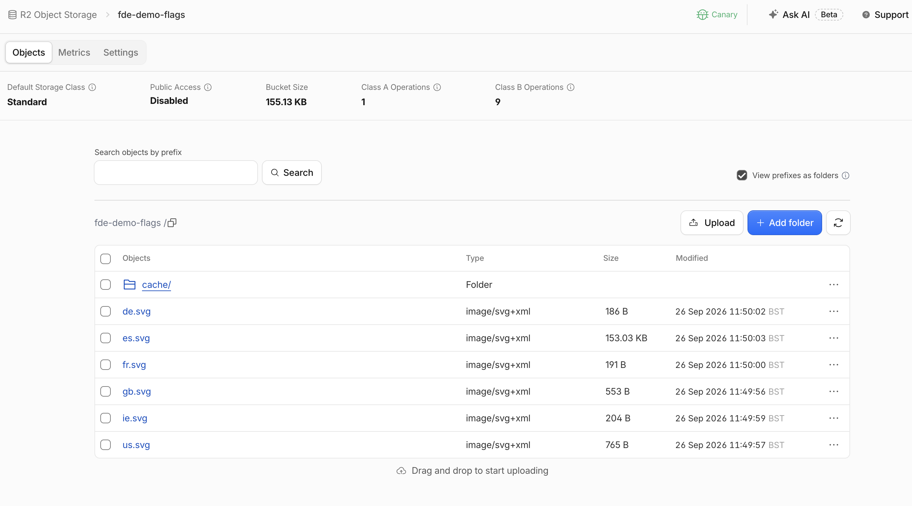

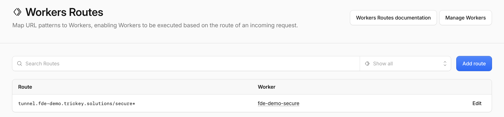

Reference: [Workers](https://developers.cloudflare.com/workers/) | [R2 Workers API](https://developers.cloudflare.com/r2/api/workers/workers-api-reference/) | [Request CF properties](https://developers.cloudflare.com/workers/runtime-apis/request/#incomingrequestcfproperties)

### Validation: the tests are live and automated

Screenshots prove a moment in time. The live validation suite proves the environment is working right now.

The demo deck Worker independently interrogates the deployed environment and proves each requirement: DNS-over-HTTPS, live HTTP probes, the Cloudflare API, an external grader, a redirect probe, and a private R2 read. It produces:

```text
✅ [Connect] Zone runs on Cloudflare
✅ [Connect] Origin IP hidden behind Cloudflare
✅ [Connect] Origin returns all request headers
✅ [Connect] Reachable via Cloudflare Tunnel
✅ [Protect] Full (Strict) TLS to origin
✅ [Protect] Independent TLS grade (A/A+)     <- Qualys SSL Labs
✅ [Protect] /secure locked by Zero Trust Access
✅ [Build]   Worker serves flag from private R2
Summary: 8 passed · 0 failed -> exit 0
```

The same endpoint doubles as a CI gate:

```bash
# Human-readable table + pass/fail exit code
BASE_URL=https://deck.fde-demo.trickey.solutions ./scripts/verify.sh

# Raw machine-readable result
curl -s https://deck.fde-demo.trickey.solutions/api/checks/run | jq
```

verify.sh exits non-zero on any hard failure, so it runs after tofu apply and wrangler deploy as the acceptance stage. The same checks could be promoted to a Cloudflare Workflow on a schedule for continuous conformance. The primitive is already there.

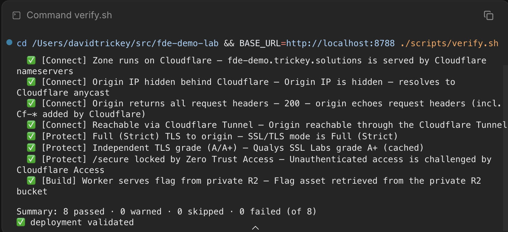

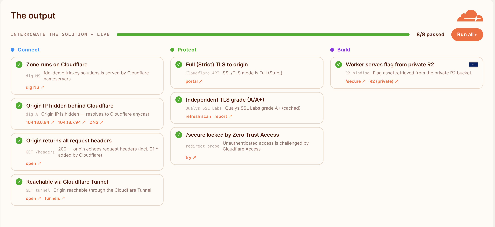

## 2b. Relevant use cases for the products

| Product | What it does here | What it does for a customer |
| --- | --- | --- |
| DNS and proxy | Front the origin, hide its IP, inject Cf-* headers | Single control point for every hostname; DDoS absorption without touching origin |
| SSL/TLS Full (Strict) | Validate encryption edge-to-origin against a publicly trusted cert | No plaintext hop to origin; meets compliance requirements |
| Rules and Snippets | Shape and transform traffic at the edge | Redirects, rewrites, header and origin control without origin changes |
| Cloudflare Tunnel | Publish a private origin with no inbound ports | Reach on-premises or private cloud apps without a VPN or firewall changes |
| Zero Trust Access | Identity-gate a path to specific users | Replace VPN for app access; verify every request, not every network perimeter |
| Identity (Google and OTP) | SSO for Cloudflare employees, PIN fallback for everyone else | Federate the corporate IdP; time-boxed access for contractors and externals |
| Workers | Identity-aware response and flag serving at the edge | Auth-aware APIs, personalisation, edge middleware, and glue logic |
| R2 (private) | Store and serve assets through a Worker, private by default | Asset storage fronted by compute, no egress fees, no public bucket exposure |
| Analytics (GraphQL and REST) | One custom observability dashboard in the deck Worker | Bespoke reporting, SLOs, and alerting pulled from the same API the dashboard uses |

These are not separate products that happen to live on the same platform. They are a chain. DNS proxying is how you hide the origin. Full (Strict) TLS is how you trust what comes back from it. The Tunnel is how you reach what cannot be exposed to the Internet. Access is how you decide who gets through. Workers is how you make it respond intelligently. R2 is how you store what the Worker serves.

The architectural journey -- from a public origin behind a proxy, to a private origin through a Tunnel, to serverless logic at the edge -- mirrors the maturity curve I see with customers in practice. You start with the thing you know you need (usually DDoS protection or a CDN). Then something shifts.

Once you are past the initial implementation, the data Cloudflare starts generating gives you a reason to ask questions of almost every part of the organisation, through the lens of security, reliability, and performance. You can have a conversation about the value of every request. That conversation opens naturally into Zero Trust for remote access, Workers for edge logic, and eventually into the analytics: what does this traffic actually tell us about our users, our attack surface, and our infrastructure? Marketing teams become interested in bot scoring as a signal for attribution quality. Risk teams in regulated sectors start asking about feeding threat telemetry into underwriting models.

That shift, from Cloudflare as a product to Cloudflare as a vantage point on your traffic, is where the genuinely interesting work starts.

## 2c. How I filled the gaps


**Free-tier zone limits.** My initial plan was to delegate `fde-demo.trickey.solutions` as its own sub-zone on a free plan. Sub-zone setups are an Enterprise-tier feature; on free or Pro you onboard an apex domain and work from there. The DNS documentation is clear on this once you find it.

What surprised me was not the limitation itself but that I did not already know it. I work almost exclusively with Enterprise customers, and when you operate at that tier for long enough, certain capabilities stop registering as special. You gradually lose track of what is and is not included in the self-service tiers -- even when, as in my case, free tier was where you started. That gap in mental model is worth naming, because it is the same gap I sometimes need to bridge when a customer is evaluating whether to move upwards from free or Pro.

Reference: [Zone setups](https://developers.cloudflare.com/dns/zone-setups/)

**Full (Strict) TLS: a local-versus-production debugging story.** Rather than provision a fresh origin certificate for this specific hostname, I reused an existing proxy endpoint from another demonstration domain and re-routed requests to it via a Cloudflare Snippet. From a user perspective the experience is identical. All my local tests passed.

Then the presentation Worker started failing one of its own checks. The error: host header mismatch. The cause took a moment to find. When the presentation Worker makes an outbound HTTP call in production, it calls the origin directly from Cloudflare's infrastructure. It does not route back through the Snippet. The host header rewrite that the Snippet was performing correctly during local development was simply not in the path.

This did not surface in local testing because `wrangler dev` routes outbound requests through the proxy as you would expect, which means the Snippet fires as designed. The production Worker does not share that assumption. It is a subtle but real difference between the local development environment and running at the edge, and it is exactly the kind of thing that does not appear in any test that only checks the happy path from a browser.

I changed the check to a warning rather than a failure, and left a note in the code. Cloudflare's local development experience is genuinely excellent. This is not a criticism of it. But any sufficiently complete implementation will eventually find the places where "works on my machine" and "works in production" quietly diverge. Finding those places, and understanding why, is the job.

**Tunnel and administrative simplicity.** Comparing the Tunnel configuration against Full (Strict) on the public origin, one difference stands out: a Tunnel is an already-authenticated, already-encrypted outbound connection. The certificate story on the private side is handled differently, and the configuration is simpler for it. This matters particularly in scenarios where you are replacing something like an HA proxy on a Kubernetes cluster. The reduction in administrative burden is the point. The Tunnel is not trying to be another layer of TLS to manage; it is trying to make TLS something you no longer need to reason about on the private network side.

**IaC and the provider version question.** Historically I have heard from customers that Terraform provider upgrades can catch you out. In practice this was not an issue here, because I primed my coding agent with the current Cloudflare Terraform provider documentation before it wrote a line of HCL. The agent had what it needed to work from the correct schema and was efficient and accurate throughout. Worth noting: since I started this project, Cloudflare announced the new [`cf` CLI](https://blog.cloudflare.com/cloudflare-cf-cli-launch/), which will simplify a number of the tasks I handled through a combination of OpenTofu and Wrangler. The IaC choices made today are not permanent decisions. They are the best available options at the time, and the platform keeps moving.

**The gap I did not plan for: writing this report.** This is the honest one.

I planned my time around how long it would take to complete the core technical tasks and build the presentation. I did not adequately account for how long writing this document would take. That turned out to be wrong by a significant margin.

I used an AI agent to help with the typing, and then I revised -- a lot. The first draft was essentially a collection of links to existing Cloudflare documentation with bullets added. Accurate, well-referenced, and almost entirely without opinion. The second draft overcorrected: it read like a sales pitch, written as though the reader needed to be persuaded rather than being someone who already knows the product and wants to understand how I think.

This version settled on something closer to a blog post. Technical where it needs to be, opinionated where I have an opinion, honest about the things that did not go as planned. I primed the writing agent with the Cloudflare blog style guide and quality rubric before this draft. Whether that is the right approach for an assignment of this kind, I genuinely do not know. I would welcome feedback on it as I iterate.

**Finally.** Regardless of the outcome of this process, I have genuinely enjoyed working on this assignment. Thinking about Cloudflare's products from a continuous delivery perspective -- from IaC to automated acceptance tests to a presentation that validates itself at runtime -- has been worthwhile. The repositories, templates, and scripts built here will carry forward into customer engagements. That is probably the most durable outcome, independent of what comes next.

## 2d. How a target customer will find this experience

I have done this with customers, and I have watched customers do this themselves. The experience varies more than you might expect.

The free plan is remarkable. The first time someone lands in the Cloudflare dashboard and starts clicking around, they usually find more than they expected. The Firewall analytics, the Workers observability, the Zero Trust event logs -- the depth of what is visible on the free tier is genuinely surprising. The free plan is a good starting point and, for many use cases, a sufficient endpoint.

The risk is the breadth of the menu. Cloudflare's offering is vast. Someone unfamiliar with the platform can feel disoriented navigating between zones, the Zero Trust dashboard, and the Workers interface. Getting from the dashboard to a working Tunnel, understanding the relationship between the connector and the Access Application, discovering that R2 requires a separate activation step -- none of that is hard, but none of it is obvious from a standing start. An FDE's job in that moment is not to explain every menu option; it is to give someone a path and a narrative.

The registrar nameserver change is the real friction. The first genuine hurdle is not Cloudflare. It is whatever registrar the customer is using. Some registrar interfaces are poor. DNS propagation takes time. I have watched customers interpret that delay as Cloudflare not working. The right approach is to name this friction before it happens, explain what to expect, and build in time for it.

The Tunnel removes the conversation-stopper. The most common blocker when trying to reach a private or on-premises resource is "I cannot expose that to the Internet." The Tunnel answers that directly. No inbound ports, no firewall changes, no VPN. The demonstration moment -- pointing at a local process running on a laptop and having it appear, identity-gated, behind a Cloudflare Access policy -- consistently lands with customers who have been told this kind of thing requires significant infrastructure work.

Infrastructure as Code changes who owns it. When I hand someone wrangler deploy and tofu apply alongside an automated acceptance test, the conversation changes. It stops being "here is what Cloudflare can do" and becomes "here is something your platform team can own, review in pull requests, and tear down cleanly." That is the difference between a proof of concept and a production adoption. Platform teams can provide templates, environment variables, and integration patterns with no secret keys in code. The IaC is not extra work; it is what makes the work transferable and, importantly, what makes it reviewable.

The developer experience is consistently underrated. Engineering teams that start building with Workers report that iterative updates ship faster. The local development loop with wrangler dev, the ability to test against a local R2 bucket seeded with real data, the zero-configuration deployment -- these things accumulate. The enthusiasm I have seen from engineering teams tends to spread organically once someone gets past the first deployment.

## A note on the interactive presentation

The presentation for this assignment is itself a Cloudflare Worker deployed to deck.fde-demo.trickey.solutions. It runs live checks against the deployed environment, pulls real observability data from the Cloudflare GraphQL API and REST endpoints, and renders everything in a browser. The API token is a Worker secret. It never reaches the client.

The observability view includes requests over time by status class, a Sankey diagram of host-to-path-to-content-type flows, DNS lookup volume, Zero Trust Access events by user, Tunnel health, and Workers execution metrics with P50 latency and error rate. None of that is in the assignment brief. It is there because it illustrates something important: the data Cloudflare generates is not locked inside the platform's own dashboards. You can pull it into anything via API. The dashboard is a convenience; the API is the product.

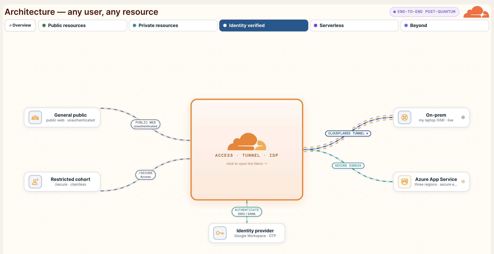

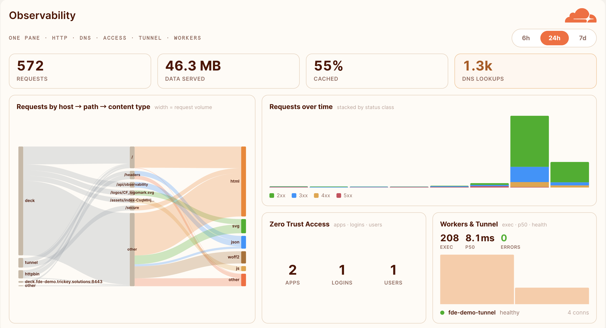

This design choice is intentional. If you are making the case that Workers are the right substrate for intelligent, identity-aware applications, you should be running your demonstration on Workers. The presentation proves what it describes.

## Repository map

```text
fde-demo-lab/                     # IaC, Worker, docs
  terraform/                      # OpenTofu, numbered by concern
    00-zone  10-dns  20-identity  30-access-lists  40-access-secure
    50-tunnel  60-r2  70-origin-security  80-worker-route
  secure-worker/                  # the /secure Worker (Wrangler)
  scripts/                        # bootstrap, deploy-worker, upload-flags, add-attendee, verify.sh
  docs/                           # this report + PREREQUISITES, REQUIREMENTS-COVERAGE, IAC-VS-CLICKOPS
fde-demo-deck/                    # presentation Worker: /api/checks + observability
fde-demo-origin/                  # dependency-free live-reload origin for the Tunnel demo
```

- Validation: ./scripts/verify.sh or GET /api/checks/run
- Requirement coverage: [REQUIREMENTS-COVERAGE.md](REQUIREMENTS-COVERAGE.md)
- IaC vs manual rationale: [IAC-VS-CLICKOPS.md](IAC-VS-CLICKOPS.md)

## Self-assessment against requirements

| Requirement | Status | Evidence |
| --- | --- | --- |
| Working application accessible | Live | https://tunnel.fde-demo.trickey.solutions/secure |
| Steps followed with config evidence | Complete | Sections above + docs/img/ screenshots |
| Screenshots of configuration | Available | docs/img/ in fde-demo-lab |
| Testing evidence | Live and automated | verify.sh + /api/checks/run + Qualys SSL Labs |
| Relevant use cases described | Complete | Section 2b above |
| Knowledge gaps documented | Complete | Section 2c above |
| Target customer experience | Complete | Section 2d above |
| Worker code in public repo via Wrangler | Complete | [secure-worker/](../secure-worker/) |
| Non-Cloudflare TLS cert, Full (Strict) | Live | Azure managed cert, ssl = "strict" in IaC |
| Private R2 bucket | Live | fde-demo-flags, no public bucket access |
| SSO IdP configured | Live | Google Workspace + One-Time PIN |
| Access policy: me + @cloudflare.com | Live | [terraform/40-access-secure.tf](../terraform/40-access-secure.tf) |
| Origin bypass prevented | Live | Tunnel (no public IP), IP allowlist, Authenticated Origin Pulls |
